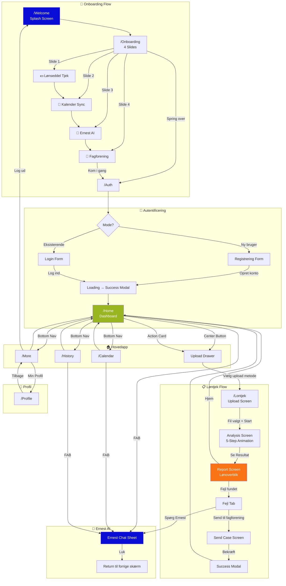
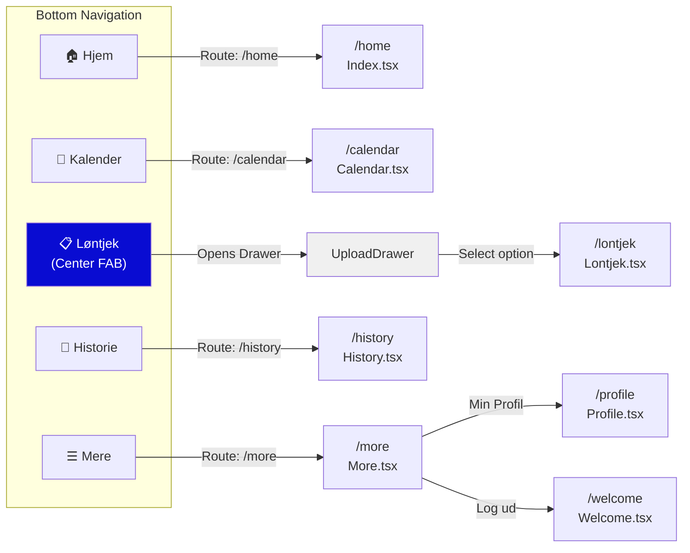
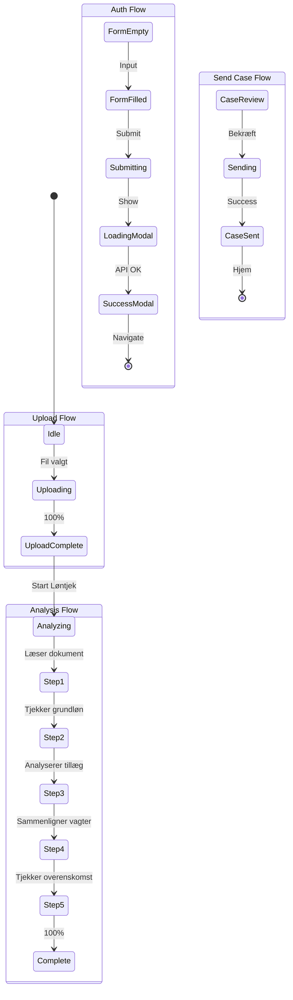
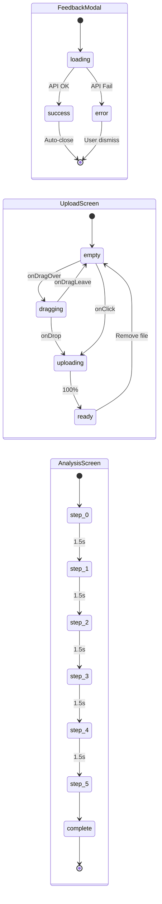

# PayTjek App - UX & UI Flow Diagrammer

## 1. UX Flow Diagram (Brugerrejse)

Dette diagram viser den komplette brugerrejse gennem appen, inklusiv beslutningspunkter og tilstande.



---

## 2. UI Flow Diagram med Empty States & Placeholders

Dette diagram viser alle skærmtilstande inklusiv empty states, loading states og placeholders.

```mermaid
flowchart TD
    subgraph HOME_STATES["🏠 Home States"]
        H1["✅ Home - Full Data<br/>• Brugerinfo<br/>• Earnings Gauge<br/>• Earned Items List"]
        H2["📭 Home - Empty Dashboard<br/>• Ingen lønsedler analyseret<br/>• 'Tilføj flere ting' placeholder"]
        H3["➕ Add Widget Placeholder<br/>border-dashed empty card"]
    end

    subgraph UPLOAD_STATES["📤 Upload States"]
        U1["📭 Upload - Empty State<br/>• Drag & drop zone<br/>• 'Tryk for at uploade'<br/>• Dashed border container"]
        U2["📁 Upload - File Selected<br/>• Fil preview card<br/>• Progress bar<br/>• AI hints tags"]
        U3["⏳ Upload - Uploading<br/>• Progress animation<br/>• Scanning effect overlay"]
        
        U1 --> |"Fil valgt"| U3
        U3 --> |"100%"| U2
    end

    subgraph ANALYSIS_STATES["🔄 Analysis States"]
        A1["⏳ Analysis - In Progress<br/>• Circular progress (0-100%)<br/>• Step list animating<br/>• Pulsing ring effect"]
        A2["✅ Analysis - Complete<br/>• 100% progress<br/>• All steps completed<br/>• 'Se Resultat' button appears"]
        
        A1 --> |"Alle steps færdige"| A2
    end

    subgraph REPORT_STATES["📊 Report States"]
        R1["✅ Report - No Errors<br/>• Grøn status chip<br/>• 'Alle tillæg korrekte'"]
        R2["⚠️ Report - Errors Found<br/>• Rød error chip<br/>• Error count badge<br/>• 'SE FEJL' knapper"]
        R3["📋 Errors Tab - Details<br/>• Error cards<br/>• Ernest AI analyse<br/>• Difference beregning"]
    end

    subgraph CALENDAR_STATES["📅 Calendar States"]
        C1["🔗 Calendar - Not Connected<br/>• CalendarSyncSetup<br/>• 'Sync Your Work Schedule'<br/>• Source selection list"]
        C2["📅 Calendar - Connected<br/>• Full calendar grid<br/>• Shift indicators<br/>• Legend"]
        C3["📭 Calendar - Day Empty<br/>• 'Ingen vagter på denne dato'<br/>• Grå placeholder text"]
        C4["📋 Calendar - Day with Shifts<br/>• ShiftDetailCard<br/>• Type, tid, timer"]
        
        C1 --> |"Connect"| C2
        C2 --> |"Vælg dag uden vagter"| C3
        C2 --> |"Vælg dag med vagter"| C4
    end

    subgraph HISTORY_STATES["📜 History States"]
        HI1["📋 Payslips Tab - With Data<br/>• PayslipReport cards<br/>• Fejl count per rapport"]
        HI2["📭 Payslips Tab - Empty<br/>• 'Ingen analyserede lønsedler'<br/>• CTA: 'Tjek lønseddel'"]
        HI3["📨 Requests Tab - With Data<br/>• Request cards<br/>• Status chips (Igangværende/Lukket)"]
        HI4["📭 Requests Tab - Empty<br/>• 'Ingen anmodninger endnu'"]
    end

    subgraph CHAT_STATES["💬 Ernest Chat States"]
        E1["💬 Chat - Initial<br/>• Welcome message fra Ernest<br/>• Quick reply buttons"]
        E2["💬 Chat - Conversation<br/>• Message bubbles<br/>• User/Ernest styling"]
        E3["⌨️ Input - Empty<br/>• Placeholder: 'Skriv nogle spørgsmål'<br/>• Mic icon"]
        
        E1 --> |"Quick reply / Type"| E2
    end

    subgraph FORM_STATES["📝 Form States"]
        F1["📧 Auth - Empty Fields<br/>• Email placeholder<br/>• Password placeholder"]
        F2["📧 Auth - Filled<br/>• Validation checklist (signup)<br/>• Remember me (login)"]
        F3["⏳ Auth - Submitting<br/>• Loading modal<br/>• Spinner"]
        F4["✅ Auth - Success<br/>• Success modal<br/>• Checkmark animation"]
        
        F1 --> F2 --> F3 --> F4
    end

    subgraph PROFILE_STATES["👤 Profile States"]
        P1["👤 Profile - Loaded<br/>• Pre-filled user data<br/>• Edit inputs"]
        P2["💾 Profile - Saving<br/>• 'Gemmer...' button state"]
        P3["✅ Profile - Saved<br/>• Toast notification<br/>• 'Ændringer gemt'"]
    end

    subgraph MODAL_STATES["🔲 Modal & Drawer States"]
        M1["📤 Upload Drawer<br/>• Camera option<br/>• Gallery option<br/>• File option"]
        M2["⏳ Feedback Modal - Loading<br/>• Spinner<br/>• Loading message"]
        M3["✅ Feedback Modal - Success<br/>• Checkmark<br/>• Success message"]
        M4["❌ Feedback Modal - Error<br/>• Error icon<br/>• Error message"]
    end

    style U1 fill:#f0f0f0,stroke:#ccc,stroke-dasharray: 5 5
    style C1 fill:#f0f0f0,stroke:#ccc,stroke-dasharray: 5 5
    style C3 fill:#f0f0f0,stroke:#ccc,stroke-dasharray: 5 5
    style HI2 fill:#f0f0f0,stroke:#ccc,stroke-dasharray: 5 5
    style HI4 fill:#f0f0f0,stroke:#ccc,stroke-dasharray: 5 5
    style H3 fill:#f0f0f0,stroke:#ccc,stroke-dasharray: 5 5
```



---

## 3. Navigation Flow Diagram



---

## 4. Empty State Component Reference

| Komponent | Empty State | Styling |
|-----------|-------------|---------|
| `UploadScreen` | Drag & drop zone uden fil | `border-2 border-dashed rounded-3xl` |
| `CalendarSyncSetup` | Kalender ikke forbundet | Full-screen setup med source liste |
| `CalendarView` (dag) | Ingen vagter på dato | `"Ingen vagter på denne dato"` med grå tekst |
| `EarnedItemsList` | Tilføj widget placeholder | `border-2 border-dashed border-border/50` |
| `History` (implicit) | Ingen lønsedler/anmodninger | Kan tilføjes med `Empty` component |
| `ErnestChat` | Initial state | Welcome message + quick replies |
| `AuthForm` | Tomme felter | Placeholder tekst i inputs |

---

## 5. Loading & Feedback States



---

## 6. Component State Machine



---

## 7. Empty State Design Patterns

### Pattern 1: Dashed Border Container (Upload)
```tsx
// Bruges i: UploadScreen, EarnedItemsList
<div className="border-2 border-dashed rounded-3xl flex flex-col items-center justify-center p-8">
  <Icon className="w-8 h-8 text-muted-foreground mb-4" />
  <h3 className="text-lg font-semibold">Titel</h3>
  <p className="text-sm text-muted-foreground">Beskrivelse</p>
  <Button variant="outline">CTA</Button>
</div>
```

### Pattern 2: Empty Component (Generisk)
```tsx
// Fra: src/components/ui/empty.tsx
<Empty>
  <EmptyHeader>
    <EmptyMedia variant="icon">
      <Icon />
    </EmptyMedia>
    <EmptyTitle>Ingen data</EmptyTitle>
    <EmptyDescription>Beskrivelse af tom tilstand</EmptyDescription>
  </EmptyHeader>
  <EmptyContent>
    <Button>Handling</Button>
  </EmptyContent>
</Empty>
```

### Pattern 3: Inline Empty Message
```tsx
// Bruges i: CalendarView
<p className="text-sm text-muted-foreground py-3 text-center bg-muted/30 rounded-xl">
  Ingen vagter på denne dato
</p>
```

---

## Anbefaling: Manglende Empty States

Følgende steder bør have eksplicitte empty states:

1. **History - Lønsedler Tab**
   - Når der ikke er analyserede lønsedler

2. **History - Anmodninger Tab**
   - Når der ikke er sendt sager til fagforening

3. **Home - EarningsGauge**
   - Når der ikke er indtjeningsdata

4. **Calendar - Månedsoversigt**
   - Når hele måneden er tom (ingen vagter)

5. **Ernest Chat - Fejl state**
   - Hvis AI ikke kan svare


